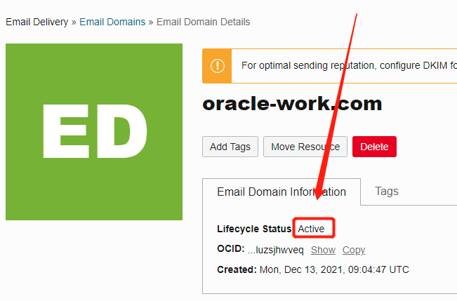

# Email Delivery

OCI Email Delivery是在线邮箱服务


# 1.创建

## 1.1. 新建邮箱




## 1.2 为发邮件配置权限和用户

### 1.2.1 配置DKIM 及 DNS，验证域名归属

a. 添加DKIM


b. 用上面分配的域名验证信息，到DNS系统中配入。 这里用阿里云域名及阿里云DNS作为展示：


c. 等10分钟~半小时， 在OCI中查看DKIM的验证状态。等待期间可以先做其他步骤。

### 1.2.2 创建组和用户

a. OCI ==> Identity & Security ==> Identity ==> Groups 添加组


b. OCI ==> Identity & Security ==> Identity ==> Users 添加用户

 


**记住下面的密码！！** 这里的**用户名**和**密码**用于**登陆邮箱**。


### 1.2.3 添加策略

a. OCI ==> Identity & Security ==> Identity ==> Policies 添加策略

```shell
Allow group email-group to use email-family in compartment <compartment name>
```


## 1.2.4 配置发送账号

a.  OCI ==> Developer Services ==> Application Integeration ==> Email Delivery ==> Email domains ==>  选择你的域名  ==> approved Senders 


# 2.使用Python发邮件

## 2.1 保存下面的文件作为ocimail.py

```python
# python script for sending SMTP configuration with Oracle Cloud Infrastructure Email Delivery
import smtplib 
import email.utils
from email.message import EmailMessage
import ssl

# Replace sender@example.com with your "From" address.
# This address must be verified.
# this is the approved sender email
# OCI ==> Developer Services ==> Application Integeration ==> Email Delivery ==> Email domains ==>  选择你的域名  ==> approved Senders 中显示的邮箱名，任意一个都可以发送
SENDER = 'admin@oracle-work.com'
# 发送者名称，随意填写
SENDERNAME = 'Admin OrcWrk'
 
# Replace recipient@example.com with a "To" address. If your account
# is still in the sandbox, this address must be verified.
# 接收者邮箱
RECIPIENT = 'wenbin.chen@oracle.com'
 
# Replace the USERNAME_SMTP value with your Email Delivery SMTP username.
# OCI ==> Identity & Security ==> Identity ==> Users ==> 选择1.2.2.b中创建的用户 ==> SMTP Credentials 中的Username那一列的值
USERNAME_SMTP = 'ocid1.user.oc1..aaaaaaaa54m6kfigxatlwnhqsh5dby7e4laxz557at3srexq3dpsyfmqax7a@ocid1.tenancy.oc1..aaaaaaaaro7aox2fclu4urtpgsbacnrmjv46e7n4fw3sc2wbq24l7dzf3kba.jj.com'


# Put the PASSWORD value from your Email Delivery SMTP password into the following file.
# 将1.2.2.c中保存下来的密码存到和本python脚本同一个目录的文件中。如果忘记了密码，就删掉 SMTP Credential 再重新创建一个
PASSWORD_SMTP_FILE = 'ociemail.config'
 
# If you're using Email Delivery in a different region, replace the HOST value with an appropriate SMTP endpoint.
# Use port 25 or 587 to connect to the SMTP endpoint.
HOST = "smtp.email.ap-tokyo-1.oci.oraclecloud.com"
PORT = 587
 
# The subject line of the email.
SUBJECT = 'Email Delivery Test (Python smtplib)'
 
# The email body for recipients with non-HTML email clients.
BODY_TEXT = ("Email Delivery Test\r\n"
             "This email was sent through the Email Delivery SMTP "
             "Interface using the Python smtplib package."
            )
 
# The HTML body of the email.
BODY_HTML = """<html>
<head></head>
<body>
  <h1>Email Delivery SMTP Email Test</h1>
  <p>This email was sent with Email Delivery using the
    <a href='https://www.python.org/'>Python</a>
    <a href='https://docs.python.org/3/library/smtplib.html'>
    smtplib</a> library.</p>
</body>
</html>"""

# get the password from a named config file ociemail.config
with open(PASSWORD_SMTP_FILE) as f:
    password_smtp = f.readline().strip()

# create message container
msg = EmailMessage()
msg['Subject'] = SUBJECT
msg['From'] = email.utils.formataddr((SENDERNAME, SENDER))
msg['To'] = RECIPIENT

# make the message multi-part alternative, making the content the first part
msg.add_alternative(BODY_TEXT, subtype='text')
# this adds the additional part to the message
# According to RFC 2046, the last part of a multipart message, in this case
# the HTML message, is best and preferred.
msg.add_alternative(BODY_HTML, subtype='html')

# Try to send the message.
try: 
    server = smtplib.SMTP(HOST, PORT)
    server.ehlo()
    # most python runtimes default to a set of trusted public CAs that will include the CA used by OCI Email Delivery.
    # However, on platforms lacking that default (or with an outdated set of CAs), customers may need to provide a capath that includes our public CA.
    server.starttls(context=ssl.create_default_context(purpose=ssl.Purpose.SERVER_AUTH, cafile=None, capath=None))
    # smtplib docs recommend calling ehlo() before & after starttls()
    server.ehlo()
    server.login(USERNAME_SMTP, password_smtp)
    # our requirement is that SENDER is the same as From address set previously
    server.sendmail(SENDER, RECIPIENT, msg.as_string())
    server.close()
# Display an error message if something goes wrong.
except Exception as e:
    print(f"Error: {e}")
else:
    print("Email successfully sent!")
```

## 2.2 参数说明
| 参数 | 描述 | 来源 |
| --- | --- | --- | 
| SENDER | 发件人邮箱 | OCI ==> Developer Services ==> Application Integeration ==> Email Delivery ==> Email domains ==>  选择你的域名  ==> approved Senders 中显示的邮箱名，任意一个都可以发送 |
| SENDERNAME | 发件人姓名 | 按各自情况填写即可 |
| FROM | 代发人邮箱 | OCI ==> Developer Services ==> Application Integeration ==> Email Delivery ==> Email domains ==>  选择你的域名  ==> approved Senders 中显示的邮箱名，任意一个都可以发送 |
| FROMNAME | 代发人名称 | 按各自情况填写即可 |
| BODY | 邮件正文 | 按各自情况填写即可 |
| RECIPIENT | 收件人邮箱 | 真实的能收件的邮箱地址即可 |
| USERNAME_SMTP | 登录账号 | OCI ==> Identity & Security ==> Identity ==> Users ==> 选择1.2.2.b中创建的用户 ==> SMTP Credentials 中的Username那一列的值 |
| PASSWORD_SMTP_FILE | 密码文件 | 将1.2.2.c中保存下来的密码存到和本python脚本同一个目录的文件中。如果忘记了密码，就删掉 SMTP Credential 再重新创建一个 |

# 3.参考应用

https://mytechretreat.com/send-emails-from-your-custom-app-with-oci-email-delivery-and-oci-functions/

# 4.参考文档

OCI Email Delivery 文档：https://docs.oracle.com/en-us/iaas/Content/Email/home.htm

OCI Email Delivery API 文档： https://docs.oracle.com/en-us/iaas/api/#/en/emaildelivery/20170907/

OCI Python SDK Email 功能：https://oracle-cloud-infrastructure-python-sdk.readthedocs.io/en/latest/api/email.html#models

